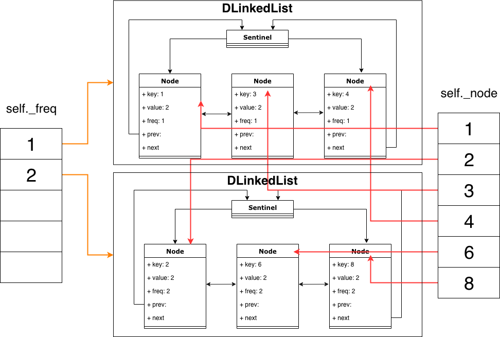

### Data structure definition
1. A Doubly linked Node
```py
class Node:
	+ key: int
	+ value: int
	+ freq: int
	+ prev: Node
	+ next: Node
```
2. A Doubly Linked List

Note: This part could be replaced by OrderedDict, I implemented it by hand for clarity
```py
class DLinkedList:
	- sentinel: Node
	+ size: int
	+ append(node: Node) -> None
	+ pop(node: Node) -> Node
```
3. Our LFUCache
```py
class LFUCache:
	- node: dict[key: int, node: Node]
	- freq: dict[freq: int, lst: DlinkedList]
	- minfreq: int
	+ get(key: int) -> int
	+ put(key: int, value: int) -> None
```
### Visualization



### Explanation
- Each key is mapping to the corresponding node (self._node), where we can retrieve the node in O(1) time.

- Each frequency freq is mapped to a Doubly Linked List (self._freq), where all nodes in the DLinkedList have the same frequency, freq. Moreover, each node will be always inserted in the head (indicating most recently used).

- A minimum frequency self._minfreq is maintained to keep track of the minimum frequency of across all nodes in this cache, such that the DLinkedList with the min frequency can always be retrieved in O(1) time.

Here is how the algorithm works
### get(key)

1. query the node by calling self._node[key]

2. find the frequency by checking node.freq, assigned as f, and query the DLinkedList that this node is in, through calling self._freq[f]

3. pop this node

4. update node's frequence, append the node to the new DLinkedList with frequency f+1

5. if the DLinkedList is empty and self._minfreq == f, update self._minfreq to f+1.

6. return node.val
### put(key, value)

- If key is already in cache, do the same thing as get(key), and update node.val as value

- Otherwise:

&emsp;  &emsp;  &emsp; - if the cache is full, pop the least frequenly used element (*)

&emsp;  &emsp;  &emsp; - add new node to self._node

&emsp;  &emsp;  &emsp; - add new node to self._freq[1]

&emsp;  &emsp;  &emsp; - reset self._minfreq to 1

(*) The least frequently used element is **the tail element in the DLinkedList with frequency self._minfreq**